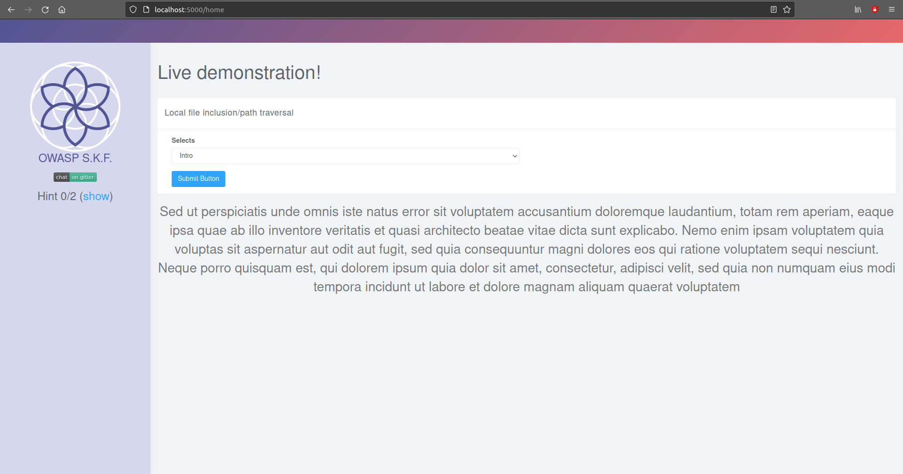
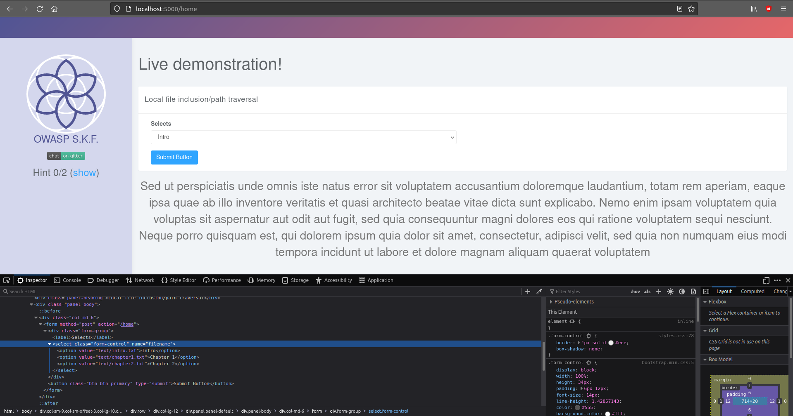
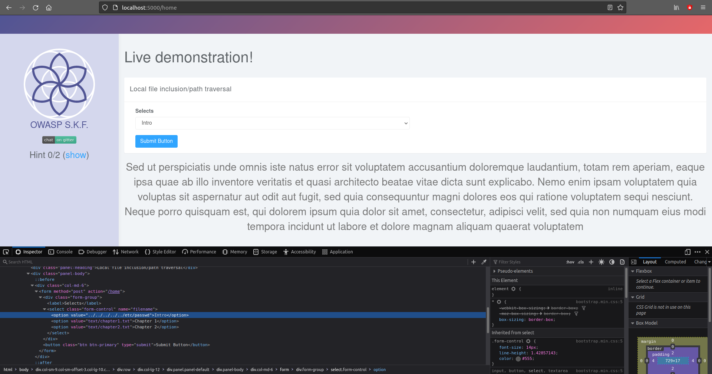
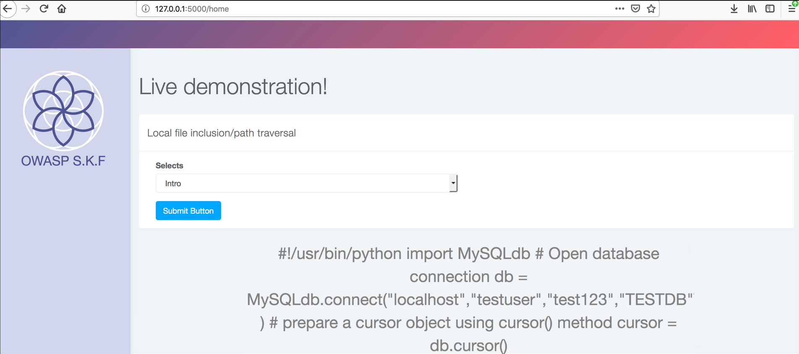

# NodeJS - Local File Inclusion 1 (LFI-1)

## Running the app nodeJs

First make sure nodejs and npm are installed on your host machine. After installation, we go to the folder of the lab we want to practice. "i.e /skf-labs/XSS, /skf-labs/RFI/" and run the following commands:

```
$ npm install
```

```
$ npm start
```


Now that the app is running let's go hacking!


## Reconnaissance

### Step1

The application shows a dropdown menu from which we can choose an intro or chapters to be displayed on the client-side.



First thing we need to do know is to do more investigation on the requests that are being made. We do this by setting up our intercepting proxy so we can gain more understanding of the application under test.

After we set up our favourite intercepting proxy we are going to look at the traffic between the server and the front-end. the first thing to notice is that it tries to retrieve a text file



The image above shows the text file that is being fetched from the servers file system highlighted in red. And the response is highlighted in blue.

```javascript
app.post("/home", (req, res) => {
  const filename = req.body.filename;
  fs.readFile(filename, "utf8", (err, data) => {
    if (err) {
      console.error(err);
      return;
    }
    res.render("index.ejs", { file: data });
  });
});
```

In the code example the "filename" parameter that is used to read content from files of the file system is under the users control. Instead of just reading the intended text files from the file system, a potential attacker could abuse this function to also read other sensitive information from the web server.

## Exploitation

### Step1

A potential attacker can now tamper the "filename" parameter to get more sensitive information from the file system. As a proof of concept in a penetration test we will often show a successful attack by getting the "/etc/passwd" file.



But other files with sensitive information can of course be just as interesting. How about getting a file with connection strings to the database? It is also not uncommon for administrators to re-use passwords. So retrieving this information could prove to be valuable information to gain access to other systems.



## Additional sources

Please refer to the OWASP testing guide for a full complete description about path traversal with all the edge cases over different platforms!


