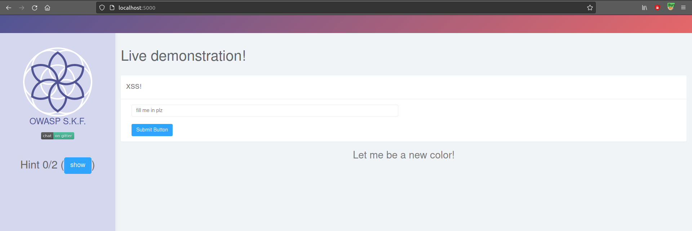
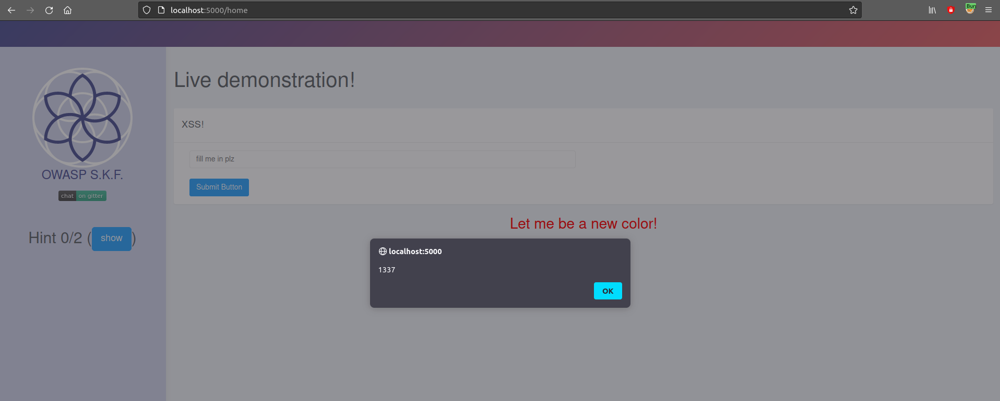

# NodeJS - XSS-Attribute

## Running the app nodeJs

First make sure nodejs and npm are installed on your host machine. After installation, we go to the folder of the lab we want to practice. "i.e /skf-labs/XSS, /skf-labs/RFI/" and run the following commands:

```
$ npm install
```

```
$ npm start
```


Now that the app is running let's go hacking!


## Reconnaissance

### Step 1

The application shows an input fields that allows the user to change the color of the text shown in the page.



If we want to make it red, we can just write `red` in the input box and click the Submit Button.


```markup
<center> <p style="font-size:2em;"><span style='color: <%- xss %>' > Let me be a new color!</span></p></center>
```

It's not escaped, so it should be possible to perform a Cross Site Scripting (XSS) injection.


## Exploitation

### Step 1

Now we have seen where the user input is being reflected in the style, we will have to look what dangerous HTML characters are not properly escaped, when the developer used the right encoding the metacharacters like " >< will be properly encoded. So we need to form a payload that does not utilize these characters in order to make the attack successful like the following payload:

_note: we disabled auto-escape for the challenge but in order to do it well you need to avoid using the " > < to leverage the attack_

```
red ' onmouseover='alert(1337)'
```

Now, hovering over the paragraph will trigger our javascript event handler!



## Additional sources

Please refer to the OWASP testing guide for a full complete description about cross site scripting!




