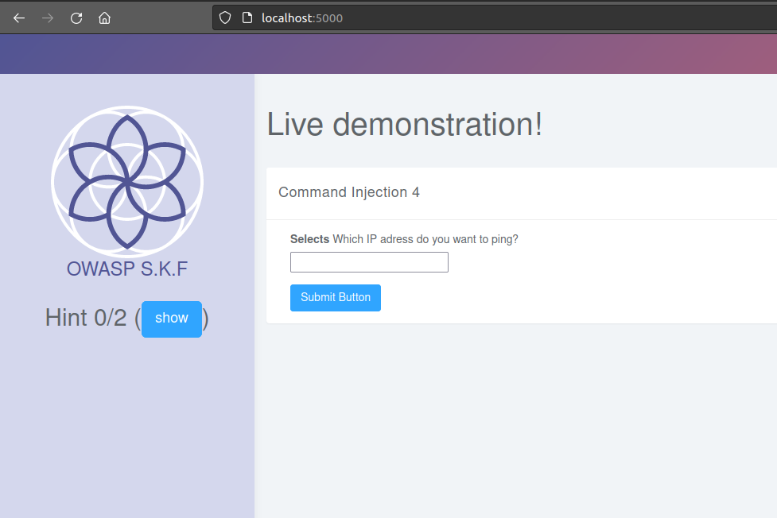
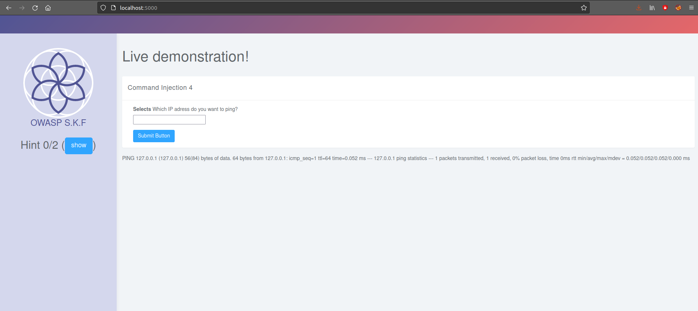
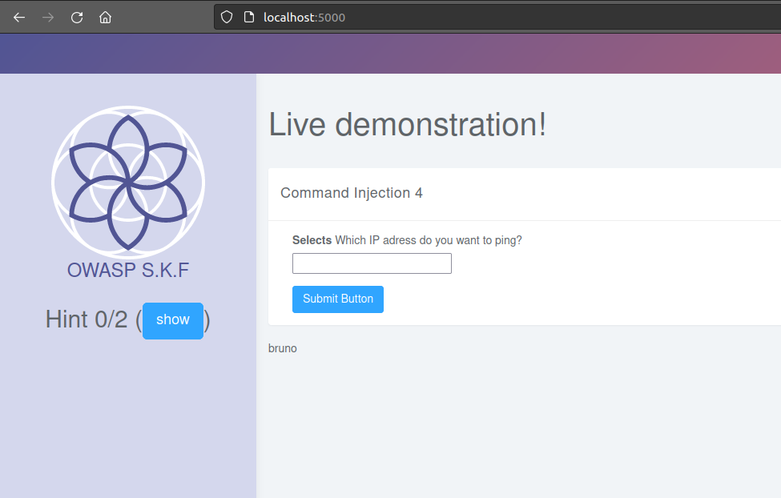

# Python - Command Injection 4 (CMD-4)

## Running the app Python3

First, make sure python3 and pip are installed on your host machine. After installation, we go to the folder of the lab we want to practise "i.e /skf-labs/XSS/, /skf-labs/jwt-secret/ " and run the following commands:

```
$ pip3 install -r requirements.txt
```

```
$ python3 <labname>
```


Now that the app is running let's go hacking!


## Reconnaissance

When we start the application we can see that we can ping an adress.



Let's try to ping 127.0.0.1



We get back the output of the ping command which tell us this might be vulnerable to a command injection.

## Exploitation

Let's try chaining commands

```
127.0.0.1 ; whoami
```

We get nothing back, maybe this application has a blacklist

```python
    ip_address = request.form['text']
    ip_address = ip_address.replace("`","")
    ip_address = ip_address.replace(";","")
    ip_address = ip_address.replace("&","")
    os.system('ping -c1 ' + ip_address + ' > ./ping_output')
```

We can see in this piece of code the app is removing certain dangerous characters in an attempt to avoid some kind of command injection. Unfortunately there are ways to bypass this blacklist approach. Let's try piping the commands:

```
127.0.0.1 | whoami
```



And we have a command injection!

## Additional sources




